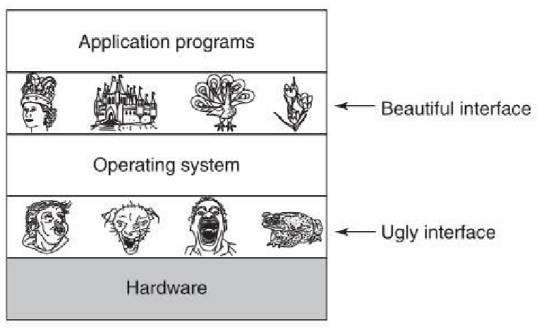

# Sodium

[](LICENSE)

Sodium is a small, hobbyist-grade i686 operating system written from scratch. It boots via Multiboot2 using GRUB and is currently focused on low-level kernel development, hardware initialization, and basic runtime services.

> **Warning:** Sodium is still in early development. Many parts are incomplete, unstable, or changing rapidly.

## Features

- Multiboot2 boot support through GRUB.
- Early i686 CPU setup, including FPU, GDT, IDT, ISR, and TSS handling.
- Physical memory management and kernel heap allocation.
- VGA text mode output and debug output.
- PS/2 controller support, including keyboard and mouse drivers.
- PC speaker support.
- A growing kernel support library with `ctype`, `stdio`, `stdlib`, and `string`.

## Repository Layout

```txt
.
├── buildsystem
│   └── i686
│       ├── CMakeLists.txt
│       ├── docker-entrypoint.sh
│       ├── Dockerfile
│       └── Makefile
├── LICENSE
├── Makefile
├── README.md
└── src
    ├── arch
    │   └── i686
    │       ├── cpu
    │       │   ├── fpu.asm
    │       │   ├── fpu.h
    │       │   ├── gdt.asm
    │       │   ├── gdt.c
    │       │   ├── gdt.h
    │       │   ├── idt.asm
    │       │   ├── idt.c
    │       │   ├── idt.h
    │       │   ├── io.h
    │       │   ├── isr.asm
    │       │   ├── isr.c
    │       │   ├── isr.h
    │       │   ├── segments.h
    │       │   ├── segments.inc
    │       │   ├── tss.asm
    │       │   ├── tss.c
    │       │   └── tss.h
    │       ├── debug.h
    │       ├── hal.c
    │       ├── libk
    │       │   └── string.asm
    │       ├── mb2
    │       │   ├── mb2.c
    │       │   └── mb2.h
    │       ├── mem
    │       │   ├── linker.h
    │       │   ├── map.h
    │       │   ├── pmm.c
    │       │   └── pmm.h
    │       ├── pic
    │       │   ├── i8259A.c
    │       │   └── i8259A.h
    │       ├── pre_kernel.c
    │       ├── pre_kernel.h
    │       ├── ps2
    │       │   ├── 8042.c
    │       │   ├── 8042.h
    │       │   ├── ps2_MF2_keyboard.c
    │       │   ├── ps2_MF2_keyboard.h
    │       │   ├── ps2_mouse.c
    │       │   └── ps2_mouse.h
    │       ├── sound
    │       │   ├── pc_speaker.c
    │       │   └── pc_speaker.h
    │       └── vga
    │           ├── text.c
    │           ├── text.h
    │           └── vga.h
    ├── bootloader
    │   └── i686
    │       ├── boot.asm
    │       ├── grub
    │       │   └── grub.cfg
    │       ├── linker.ld
    │       └── shutdown.asm
    ├── kernel
    │   ├── hal.h
    │   ├── kernel.c
    │   ├── kernel.h
    │   └── memory
    │       ├── heap.c
    │       └── heap.h
    └── libk
        ├── ctype.c
        ├── ctype.h
        ├── stdio.c
        ├── stdio.h
        ├── stdlib.c
        ├── stdlib.h
        ├── string.c
        └── string.h
```

## Architecture

Sodium is split into three main layers:

- `src/bootloader/i686`: Multiboot2 boot code, GRUB config, and initilizing Stack and BSS before jumping into C.
- `src/arch/i686`: Architecture-specific hardware setup and drivers.
- `src/kernel` and `src/libk`: Generic kernel code.

This separation keeps hardware-specific code isolated from kernel logic and makes the project easier to extend over time.

# OS Layer Stack


## Initialization Flow

1. Parse Multiboot2 information.
2. Set up low-level CPU structures.
3. Initialize memory management.
4. Bring up the kernel heap.
5. Initialize VGA and debug output.
6. Set up interrupt handling and IRQ routing.
7. Initialize input and device support.
8. Enter the kernel main loop.

## Build

Sodium uses a Docker-based build environment to keep builds reproducible across hosts.

### Requirements

- Docker
- Make
- QEMU for running the kernel in emulation

### Build Targets

Common targets exposed by the project Makefiles include:

- `make build` and `make build BUILD=Debug`
- `make build BUILD=Release`
- `make run`
- `make debug` (gdb server support)
- `make clean`

See all Targets and explaination with `make help`

### Running

After building, the produced kernel image can be launched in QEMU using the project’s generated bootable image or your usual local run setup.

## Development Notes

- The kernel heap should be initialized before using dynamic allocation.
- Several subsystems are still under active development.
- The repository layout may continue to evolve as more kernel services are added.

## License

Sodium is licensed under the [MIT License](LICENSE).
